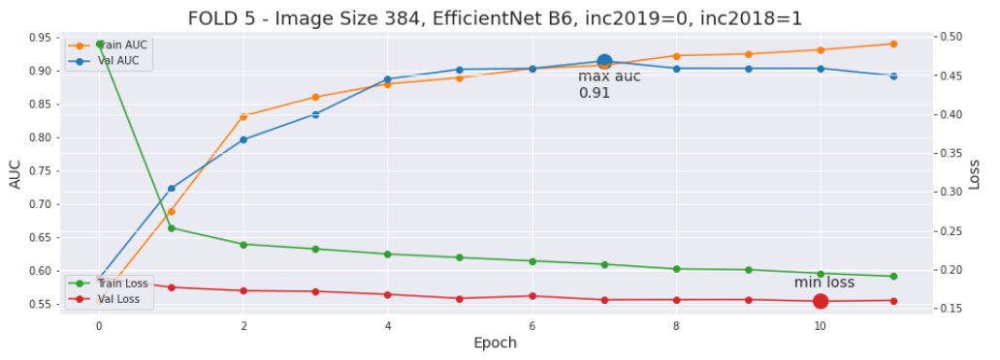
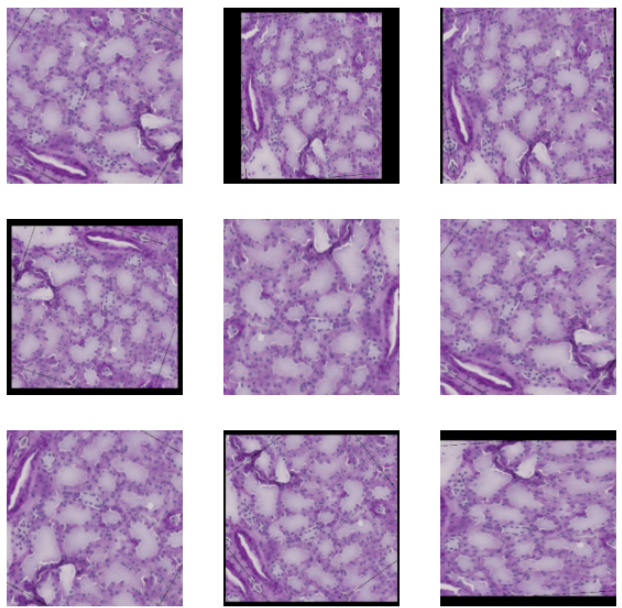

# Description of this portfolio

This portfolio contains my notebooks about machine and deep learning algorithms applied on **image data**. This data was downloaded from different sources and it's freely availble. If you can't see my notebooks here, you can use [nbviewer](https://nbviewer.org/). The notebooks are described below: 

## 1.  [EfficientNet with Attention Mechanism for Image Classification](notebooks/melanoma-efficientnetb6-with-attention-mechanism.ipynb) 

  

## 2. [Image Augmentations with TensorFlow 2.x](notebooks/hubmap-keras-augmentation-layers.ipynb)

**Contact**: hiramcoria@gmail.com